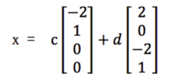
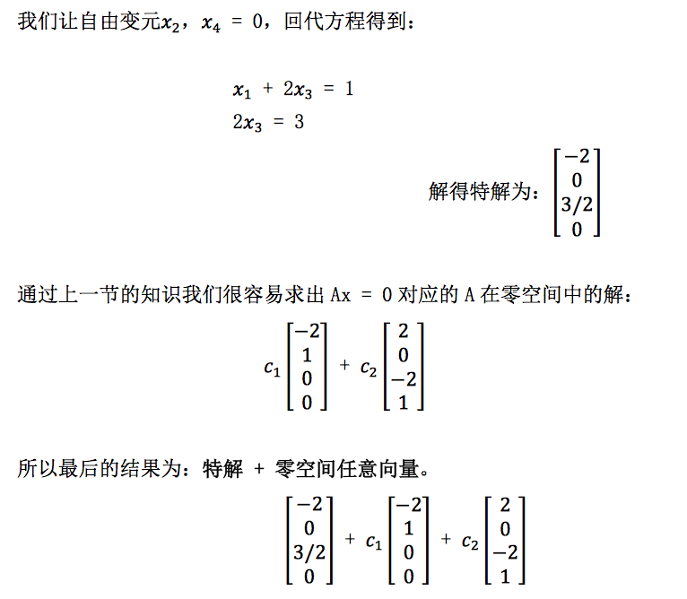

# 08-求解 Ax=b 可解性和解的结构

## 1、Overview(概述)

上一节我们首先讨论了矩阵，然后学习到了从矩阵引出的空间的概念，并且学习了 Ax=0 的求解过程。这一节中我们将进一步来探讨，给出求解 Ax=b 的一般求解方法以及可解条件。并总结上一节中提到的 “秩” 对不同形式方程的解的影响。

## 2、Ax=b 的解

### 2.1、可解性

这节我们要介绍如何来解 Ax=b ，但是这个方程并不一定有解。我们通过一个例子来说明下这个问题: 

【例1】

这里的 A 有一个特点，就是 1, 2 两行之和等于第三行。根据之前学到的技巧（[02-矩阵消元](https://github.com/apachecn/math/blob/master/02-%E7%9F%A9%E9%98%B5%E6%B6%88%E5%85%83/02-%E7%9F%A9%E9%98%B5%E6%B6%88%E5%85%83.md) 的增广消元法），列增广矩阵后消元，由于之前写过比较详细的消元步骤这里我们就不再赘述了。直接得到: 

再看这个条件： ，它反映了一种线性组合特点，即 b 向量的第三个分量是前两个分量之和。反过来看 A 矩阵本身特点，发现 A 矩阵第三行也是前两行的和。记得之前我们说过， Ax=b 有解的条件是 b 在 A 的列空间中。这个例子再一次印证了这个条件。

我们从本题中得到一个启示： Ax=b 有解的条件: 
* 列空间角度：当且仅当 b 属于 A 的列空间时成立。
* 线性组合角度： b 必须是 A 各列的线性组合。
* A 矩阵本身变换角度：如果 A 的各行线性组合得到零行（如【例1】），那么对 b 取相同运算方式，必将得到自然数 0.

### 2.2、完整解方程过程

接下来我们通过通解，特解，并借此求解方程 Ax=b 。

我们接着 【例1】开始聊。设  满足可解条件，我们来彻底求解方程。

首先，我们介绍一下 **通解** 的概念。什么是通解呢？就是满足这个方程的所有解。将 “无穷解” 用一种形式表达出来。

对于 Ax=b 这个方程， **通解 = 矩阵零空间向量 + 矩阵特解** 。这很好理解，矩阵零空间向量代入方程最后结果等于 0 ，所以它不会影响等式，而是把方程的解向量扩展到一个类似子空间上，使我们求出的解更具有普遍意义。而矩阵零空间向量我们之前介绍过，那么我们只需要关注 **特解怎么求** 就好了。

上一节中，我们求解 Ax = 0 方程的特解时，分别将自由变量赋值为 0/1, 这是因为最特殊的赋值方式： **自由变元全部赋值为 0** 的方式在 Ax=0 中行不通，因为这样的赋值方式在 Ax=0 中得到的是零向量，但是我们最后求出的通解为: 

只要将系数全部定为 0 就可以得到 “零向量” 这个解。很明显在解 Ax=0 时不能将自由变元全赋值为 0.

但是 Ax=b 这个方程不同，只要 b 不是 0，我们就可以将 **自由变元全部赋值为 0** 。本例中我们使用此方法得到特解。

以下是完整的过程：

这个解集在几何角度的解释为：  上的一个二维平面，很显然，这个解集无法构成一个向量空间，因为解集中连零向量都没有。也就可以理解为：解集在空间中变现为  中的一个不过原点的平面。

## 3、m*n 的矩阵 A 的秩与解的关系

很明显在上面我们消元求 Ax=b 的过程中，矩阵 A 的秩对最后解的形式有至关重要的影响，下面我们就总结一下这方面的问题。

### 3.1、列满秩

即 m*n 的矩阵 A 中，秩 R = n < m 。例如：

主元。也就是说这样的矩阵零空间向量中只有一个向量——零向量。这样的矩阵 A 的构造的方程 Ax=b ，要么不满足可解条件，要么只有一种符合对应方程组的解。

解最后只有两种情况：

* 有解且唯一
* 无解，不满足可解条件

### 3.2、行满秩

即 m*n 的矩阵中，秩 R = m < n 。例如：

上一节我们介绍过，这样的矩阵消元之后会是 [I F] 形式（I 表示单位阵，F 表示其他部分），很明显由这样的矩阵构成的方程 Ax=b ，最后肯定是无穷多个解，因为这种矩阵中，永远有自由变元（n-R）个。

### 3.3、行列皆满秩

当 m*n 矩阵 A 是方阵时，即有 m = n 时，那么秩 R = m 时，R 也一定等于 n 。例如：

这种矩阵经过消元，必可以化为单位阵 I ，自由变量个数为 0。只能得到一个全是主元的方程组。所以这种矩阵构成的 Ax=b 方程最后只能有唯一解。

### 3.4、不满秩

秩 R < n, 而且 R < m 时，A 矩阵不满秩，此时 A 可化简为  形式，最后化简结果中有 0 行。如 【例1】 中的矩阵，b 的分量与零行牵扯出了可解条件的存在。所以这样的矩阵 A 所构成的 Ax=b 方程解有两种情况：

* 不满足可解条件（零行导致的可解条件）
* 解无穷多个（特解 + 零空间所有向量）

### 3.5、总结

观察以上情况，自由变量总为 (n-r) 个，所以先判断自由变量个数可以初步判断 Ax=b 的解的结构：

而可解条件的产生是由于 A 消元之后的 0 行导致的，所以再判断 A 消元之后会不会有零行产生就可以确定解的结构：

## 4、小结

本节基于上一节中零空间的求解，延伸介绍了 Ax=b 的一般解法。并从 A 矩阵秩的角度探讨了秩与方程解的结构之间的联系。至此我们已经学完了解方程 Ax=b 形式矩阵方程的所有问题，在这个过程中，我们需要注意的无非就是自由变元个数，以及通解和特解的问题，整体而言，这部分重在求解流程以及如何理解。正确理解向量空间之后，理解这种矩阵方程问题也就不是什么难事了！！

【[上一章](../07-求解Ax=0-主变量-特解/07-求解Ax=0-主变量-特解.md)】【[下一章](../09-线性相关性-基-维数/09-线性相关性-基-维数.md)】
