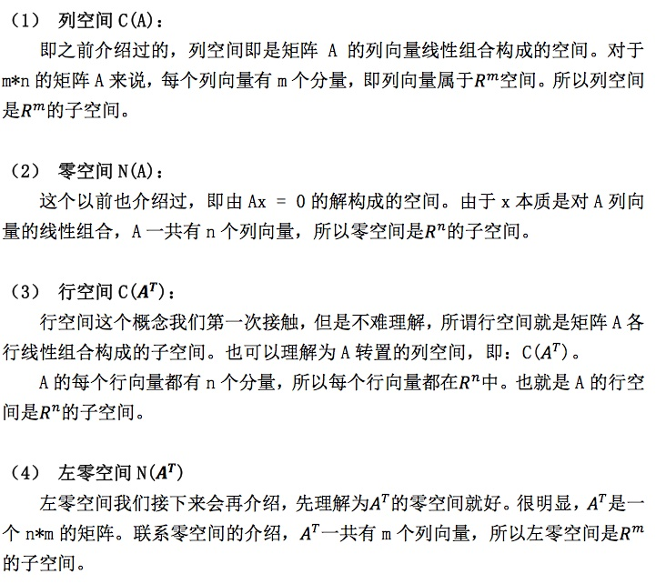
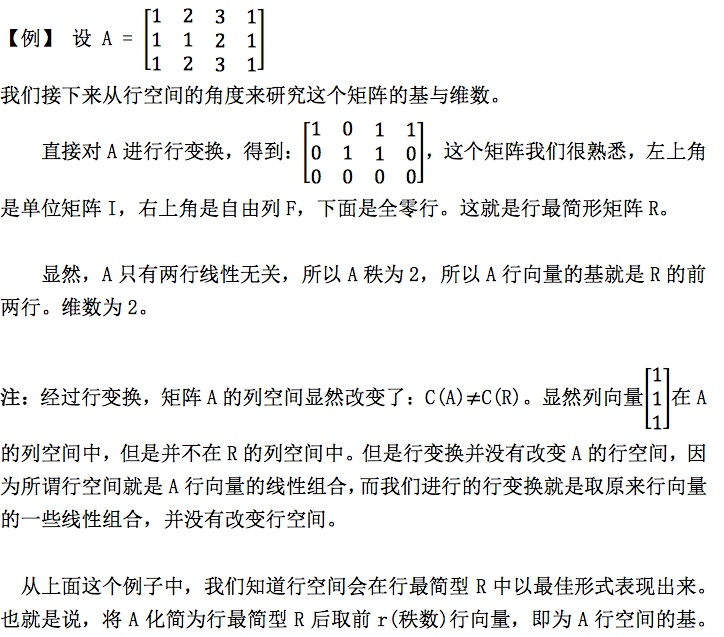
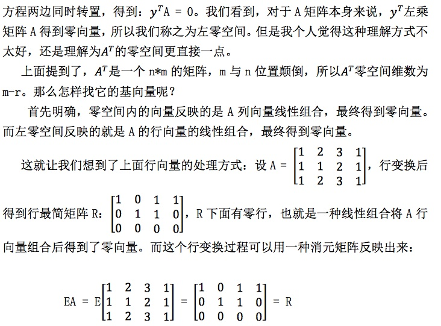
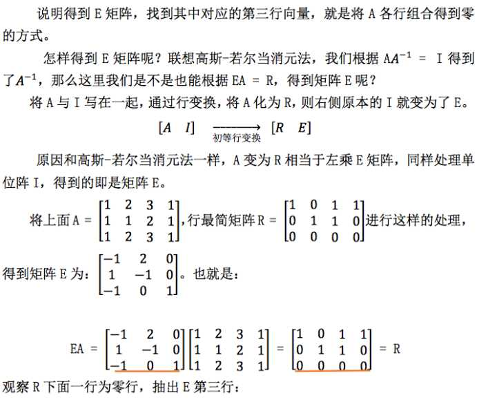
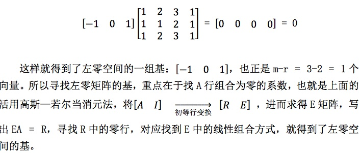
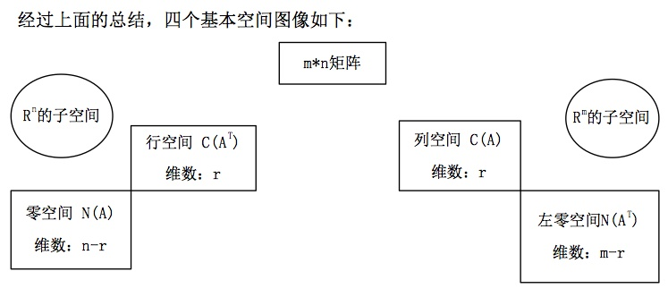

# 10-四个基本子空间

## 1、Overview（概述）
在前几节中，我们介绍过列空间，零空间。但是这还远远不够，对一个矩阵来说，我们能从它身上挖掘出来的空间不止这些，所以这一节我们介绍四个基本子空间，也是对空间概念的补充，更便于我们接下来的讨论。

## 2、四个基本子空间的介绍

### 2.1、四个基本空间的维数与基

还是研究 m*n 的矩阵A，其四个子空间的基本性质如下： 
* (1) 列空间

之前介绍过列空间的基，设矩阵 A 的秩为 r ，则 A 有 r 个主列，这 r 个主列就是列空间 C(A) 一组基，一组基里有 r 个向量，所以列空间维数为 r 。

* (2) 零空间

同样的，我们之前介绍过矩阵 A 秩为 r 时，自由列为 n-r 列。这 n-r 列决定了 x 中的 n-r 个自由变元，赋值后就构成了零空间的 n-r 个基向量，故零空间维数为 n-r。

* (3) 行空间

A 的行空间可以化为  的列空间。但我们这里使用的方法是直接对 A 的行 向量进行变换（其实一样），最后行空间的维数也是秩数 r。

* (4) 左零空间

首先介绍一下左零空间，写成方程形式为  ，我们不处理  ，所以将

### 2.2、四个基础空间图像

## 3、矩阵空间

这是一种新的对空间的定义，实际上，线性空间的元素并不一定是实数组成 的向量，我们可以将所有 3 * 3  的矩阵当成一个所谓 “向量空间” 中的向量，只要 满足线性空间的八条规律，对线性运算封闭，就可以将其当做线性空间中的元素。 因为矩阵本身也满足线性空间的八条运算律，我们就可以将所有的 3 * 3 矩阵看做 一个线性空间。

这里先渗透一下这个概念，先不用深入了解，下节中会提到部分的详细内容。

总之，这里我们将所有的 3 * 3 矩阵看做了一个线性空间，那么它的子空间有 什么呢？

上三角矩阵，对称矩阵，对角矩阵。

而很明显，上三角矩阵与对称矩阵的交集为对角矩阵(diag)。深入研究对 角矩阵，就要给出它的基，

## 4、小结

这一节课中也基本是概念的介绍，介绍了四个基本空间，其中比较新的内容是左零空间，即行向量的线性组合得到零，这部分要好好理解。前面重点在于 2.2 的图，在我们以后的应用中会经常用到。另外还稍微说到了一下向量空间的概念，为我们下一节的内容埋下了一个小伏笔。

【[上一章](../09-线性相关性-基-维数/09-线性相关性-基-维数.md)】【[下一章](../11-矩阵空间-秩1矩阵和小世界图/11-矩阵空间-秩1矩阵和小世界图.md)】
