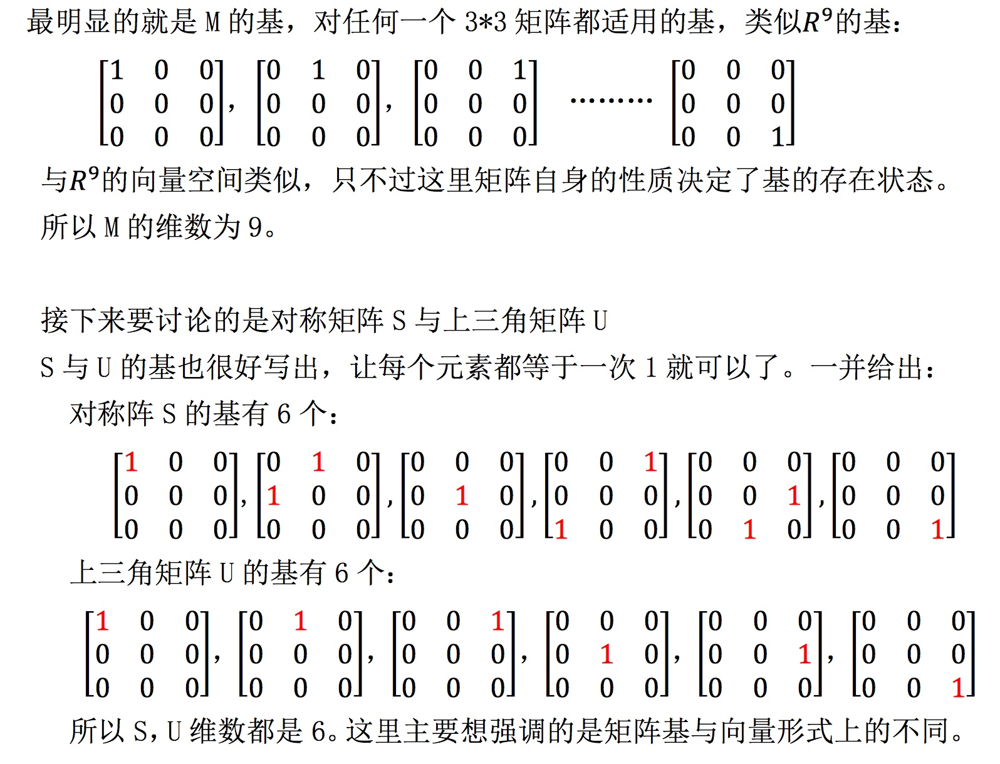
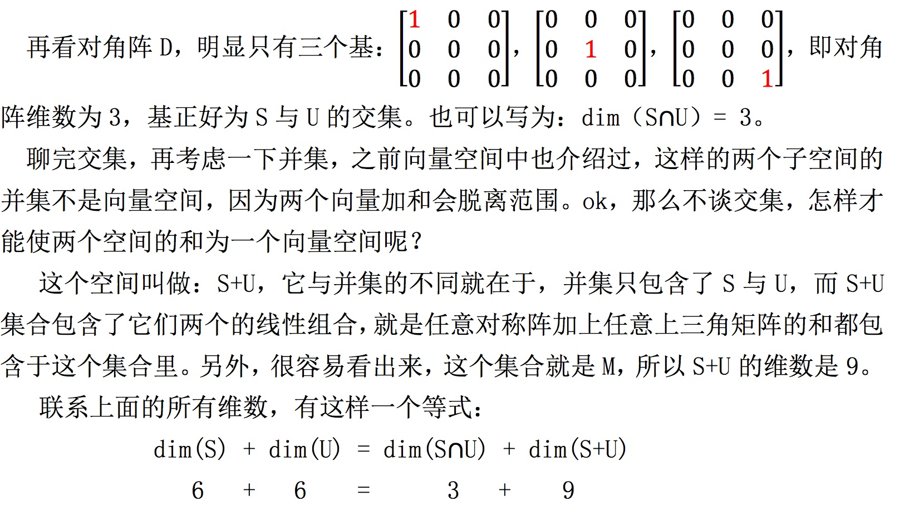
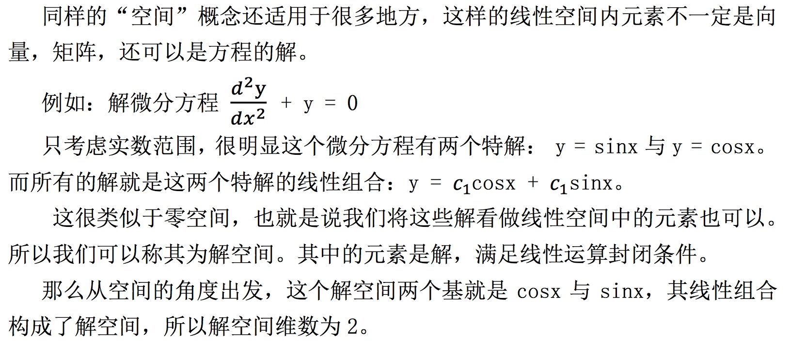
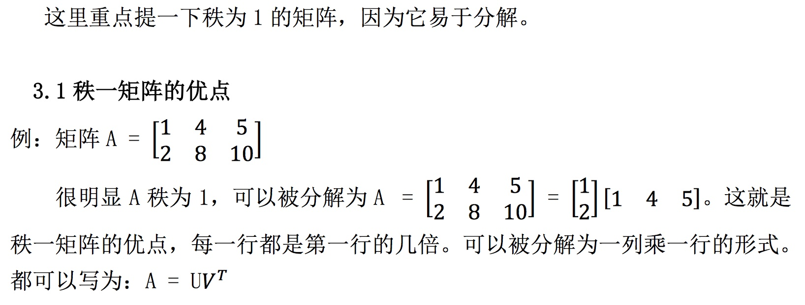
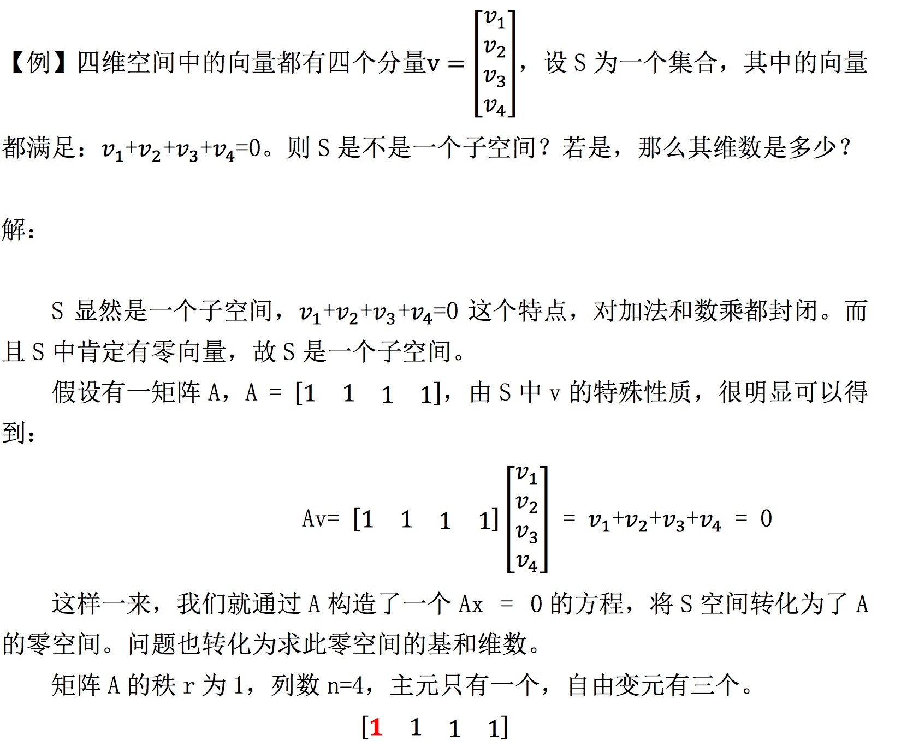
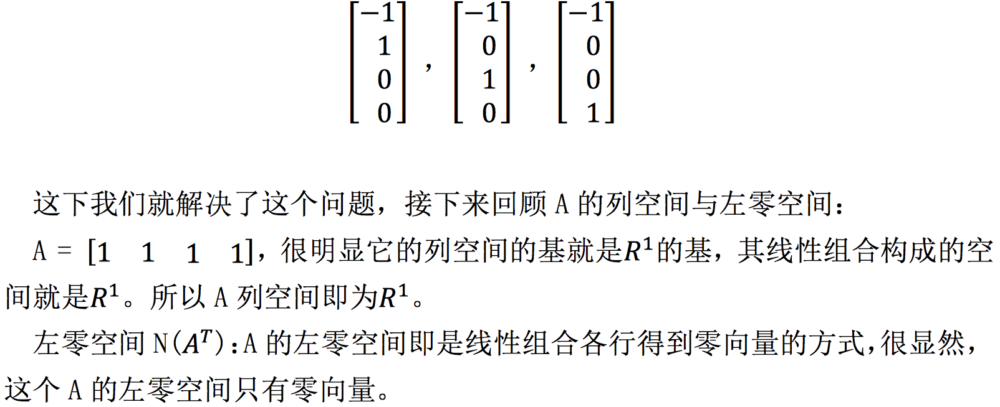
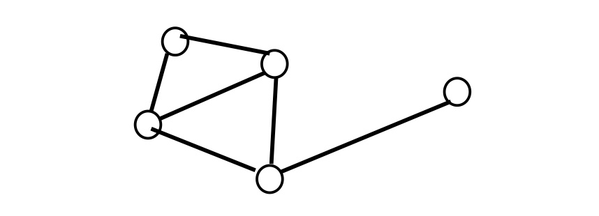

# 11-矩阵空间-秩1矩阵和小世界图

## 1、Overview（概述）

上节末尾我们介绍了矩阵空间，这是一种延伸的向量空间。这节我们从矩阵空间谈起，介绍矩阵空间的维数，基等问题。渗透一些微分方程与线性代数之间的联系，并介绍秩为 1 的矩阵特点。

## 2、矩阵空间

还是上一节中的问题，将所有的 3 * 3 的矩阵都看做 “向量空间” 中的元素，很明显，由所有 3 * 3 矩阵构成的集合中，矩阵之间加法与数乘矩阵都是封闭的，所以所有 3 * 3 矩阵构成的集合 M 可以称为空间。

上节中我们介绍，M 有两个基本的子空间：
* 1.对称矩阵 S
* 2.上三角矩阵 U

上面两个矩阵集合中，加法封闭与数乘封闭都很容易得到证明。而 S 与 U 空间相交，得到另一个子空间：对角阵 D.

### 2.1、基与维数

### 2.2、微分方程

## 3、秩一空间

秩一矩阵的另外一个优点是它可以 “搭建” 其他矩阵，比如秩为 4 的矩阵， 通过四个秩一矩阵就能搭建出来。具体过程类似于矩阵乘法中的“列乘行”形式， 通过一列一行搭出一个矩阵。

### 3.2、空间角度解释同秩矩阵

### 3.3、子空间的转化

下面我们通过这样一个例子再加深一下对子空间的印象：

因此维度为 **n-r=3** ， S 的零空间是三维空间。其基为 Av=0 的三个特解。

## 4、小世界图

这部分是对下一节 “图与网络” 的引出，主要渗透一下图与矩阵的关联。

有这样一个图：

这个图包括五个节点和六条边，可以用一个 5*6 的矩阵来表示其中的所有信 息。具体内容我们下节课再说。

另外，大家应该也听说过 “六度分割理论” ， 任何两位素不相识的人之间， 通过一定的联系方式，总能够产生必然联系或关系。这个概念即是将人抽象成点， 将联系抽象为图。

这一节是渗透一些关于图与矩阵之间会有联系的思想，具体内容下节再谈。

## 5、小结

这一节中主要介绍了线性空间，一并介绍了类似于矩阵空间，解空间这一类空间的存在。另外，秩一矩阵将我们之前学习的矩阵乘法列乘行方式联系了起来，便于分解，可以搭建矩阵。
【[上一章](../10-四个基本子空间/10-四个基本子空间.md)】【[下一章](../12-图和网络/12-图和网络.md)】
